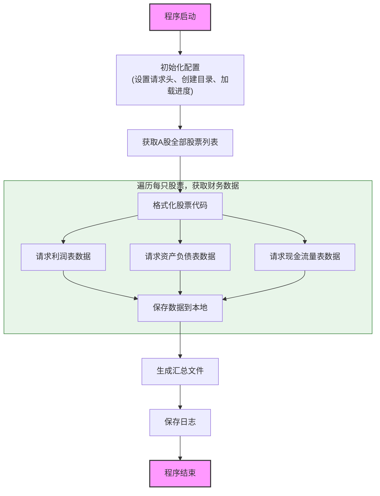

# A股财务数据爬虫详解

这篇文章会带你一步步理解如何从东方财富网爬取A股全部上市公司的财务数据。我会按照代码执行的流程，逐个函数讲解每个步骤是怎么实现的。

## 整体流程

在开始写代码之前，先理清楚整个爬虫的执行流程：





 	


理解了这个流程后，我们来看代码是怎么一步步实现的。

---

## 一、程序入口：main函数

任何程序的执行都有一个入口点。这个爬虫的入口是 `main` 函数：

```python
def main():
    print("=" * 60)
    print("A股财务数据爬虫")
    print("=" * 60)
    print("\n安全措施:")
    print("  - 请求间隔: 0.5-0.8秒 (随机)")
    print("  - 并发线程: 3个")
    print("  - 断点续爬: 支持")
    print("  - 进度保存: 每50只股票保存一次")
    print("  - 错误重试: 最多3次")
    print()
    
    crawler = AllStockFinancialCrawler(output_dir="A股财务数据")
    
    crawler.crawl_all_stocks(
        max_workers=3,
        stock_limit=None
    )
```

这个函数做的事情很简单：先打印一些提示信息，告诉用户爬虫的配置参数，然后创建一个爬虫对象，最后调用 `crawl_all_stocks` 方法开始爬取。

这里有两个参数需要注意：

- `max_workers=3`：使用3个线程并发爬取，加快速度
- `stock_limit=None`：不限制爬取数量，爬取全部A股

---

## 二、初始化：__init__函数

创建爬虫对象时，会自动调用 `__init__` 方法进行初始化。这个方法负责设置爬虫运行所需的一切配置。

```python
def __init__(self, output_dir="A股财务数据"):
    self.output_dir = output_dir
    self.base_url = "https://datacenter-web.eastmoney.com/api/data/v1/get"
    self.stock_list_url = "http://82.push2.eastmoney.com/api/qt/clist/get"
```

首先设置两个关键的URL地址：

- `base_url`：获取财务报表数据的接口
- `stock_list_url`：获取股票列表的接口

接下来设置请求头，让我们的请求看起来像是来自浏览器：

```python
    self.headers = {
        'User-Agent': 'Mozilla/5.0 (Windows NT 10.0; Win64; x64) AppleWebKit/537.36',
        'Referer': 'https://data.eastmoney.com/',
        'Accept': '*/*',
        'Accept-Language': 'zh-CN,zh;q=0.9,en;q=0.8',
    }
    self.session = requests.Session()
    self.session.headers.update(self.headers)
```

为什么要设置请求头？因为网站可能会检查请求来源，如果没有设置User-Agent，网站可能拒绝请求或返回错误数据。使用Session对象的好处是可以复用TCP连接，提高效率。

然后定义要获取的报表类型：

```python
    self.report_types = {
        '主要财务指标': 'RPT_DMSK_FN_INCOME',
        '资产负债表': 'RPT_DMSK_FN_BALANCE',
        '利润表': 'RPT_DMSK_FN_INCOME',
        '现金流量表': 'RPT_DMSK_FN_CASHFLOW',
    }
```

这是一个字典，键是报表的中文名称，值是东方财富网API对应的报表名称参数。

接下来初始化一些状态变量：

```python
    self.lock = threading.Lock()
    self.progress = {
        'total': 0,
        'completed': 0,
        'failed': 0,
        'failed_stocks': [],
        'processed_stocks': set()
    }
```

这里用到了线程锁 `threading.Lock()`，因为多线程环境下多个线程可能同时修改进度数据，需要加锁保证数据一致性。`progress` 字典记录爬取进度，包括总数、成功数、失败数、失败股票列表、已处理的股票集合。

最后设置一些控制参数：

```python
    self.request_interval = 0.5
    self.max_retries = 3
    self.timeout = 30
    
    self._create_directories()
    self._load_progress()
```

- `request_interval`：请求间隔，每次请求后等待0.5秒
- `max_retries`：失败后最多重试3次
- `timeout`：请求超时时间30秒

然后调用两个私有方法：`_create_directories` 创建存储目录，`_load_progress` 加载之前的进度（如果有的话）。

---

## 三、创建目录：_create_directories函数

这个函数负责创建存储数据所需的目录结构：

```python
def _create_directories(self):
    for report_type in self.report_types.keys():
        dir_path = os.path.join(self.output_dir, report_type)
        os.makedirs(dir_path, exist_ok=True)
    
    os.makedirs(os.path.join(self.output_dir, "汇总数据"), exist_ok=True)
    os.makedirs(os.path.join(self.output_dir, "日志"), exist_ok=True)
    os.makedirs(os.path.join(self.output_dir, "进度"), exist_ok=True)
```

逻辑很简单：遍历报表类型，为每种报表创建一个目录，另外再创建"汇总数据"、"日志"、"进度"三个目录。

`exist_ok=True` 参数表示如果目录已存在不会报错，这样即使程序中断后重新运行，也不会因为目录已存在而失败。

最终创建的目录结构如下：

```
A股财务数据/
├── 利润表/
├── 资产负债表/
├── 现金流量表/
├── 汇总数据/
├── 日志/
└── 进度/
```

---

## 四、加载进度：_load_progress函数

这个函数实现了断点续爬的核心功能：

```python
def _load_progress(self):
    progress_file = os.path.join(self.output_dir, "进度", "progress.json")
    if os.path.exists(progress_file):
        try:
            with open(progress_file, 'r', encoding='utf-8') as f:
                saved = json.load(f)
                self.progress['processed_stocks'] = set(saved.get('processed_stocks', []))
                self.progress['completed'] = saved.get('completed', 0)
                self.progress['failed'] = saved.get('failed', 0)
            print(f"已加载进度: 已处理 {len(self.progress['processed_stocks'])} 只股票")
        except Exception as e:
            print(f"加载进度失败: {e}")
```

工作流程：

1. 检查进度文件 `progress.json` 是否存在
2. 如果存在，读取文件内容
3. 将已处理的股票代码加载到 `processed_stocks` 集合中
4. 恢复成功数和失败数

这样即使程序中断，下次启动时也能从上次停止的地方继续，而不是从头开始爬取5000多只股票。

对应的保存进度函数是 `_save_progress`：

```python
def _save_progress(self):
    progress_file = os.path.join(self.output_dir, "进度", "progress.json")
    try:
        with open(progress_file, 'w', encoding='utf-8') as f:
            json.dump({
                'processed_stocks': list(self.progress['processed_stocks']),
                'completed': self.progress['completed'],
                'failed': self.progress['failed'],
                'last_update': datetime.now().strftime('%Y-%m-%d %H:%M:%S')
            }, f, ensure_ascii=False, indent=2)
    except Exception as e:
        print(f"保存进度失败: {e}")
```

注意集合不能直接JSON序列化，需要先转换成列表。

---

## 五、获取股票列表：get_all_stock_list函数

这是爬虫的第一步，获取A股全部股票的代码和名称：

```python
def get_all_stock_list(self):
    print("正在获取A股股票列表...")
    
    all_stocks = []
    page = 1
    page_size = 500
```

初始化三个变量：

- `all_stocks`：存储所有股票信息的列表
- `page`：当前页码，从1开始
- `page_size`：每页返回500条数据

然后进入一个无限循环，不断请求下一页数据：

```python
    while True:
        params = {
            'pn': page,
            'pz': page_size,
            'po': 1,
            'np': 1,
            'ut': 'bd1d9ddb04089700cf9c27f6f7426281',
            'fltt': 2,
            'invt': 2,
            'fid': 'f3',
            'fs': 'm:0+t:6,m:0+t:80,m:1+t:2,m:1+t:23',
            'fields': 'f12,f14',
            '_': int(time.time() * 1000),
        }
```

参数解释：

- `pn`：页码
- `pz`：每页数量
- `fs`：股票筛选条件，这个值表示A股全部股票
- `fields`：返回字段，f12是股票代码，f14是股票名称
- `_`：时间戳，防止缓存

发送请求并解析响应：

```python
        try:
            response = self.session.get(self.stock_list_url, params=params, timeout=self.timeout)
            response.raise_for_status()
            
            text = response.text
            if text.startswith('jQuery'):
                json_start = text.index('(') + 2
                json_end = text.rindex(')') - 1
                json_str = text[json_start:json_end]
                data = json.loads(json_str)
            else:
                data = response.json()
```

这里有个细节：东方财富网的某些接口返回的是JSONP格式，也就是 `jQuery...({...})` 这样的形式。需要提取括号内的JSON字符串再解析。

解析成功后，提取股票代码和名称：

```python
            if data and 'data' in data and data['data'] and 'diff' in data['data']:
                stocks = data['data']['diff']
                for stock in stocks:
                    if isinstance(stock, dict):
                        stock_code = stock.get('f12', '')
                        stock_name = stock.get('f14', '')
                        if stock_code:
                            all_stocks.append({'股票代码': stock_code, '股票名称': stock_name})
                
                total_count = data['data'].get('total', 0)
                print(f"  已获取 {len(all_stocks)}/{total_count} 只股票...")
                
                if len(all_stocks) >= total_count:
                    break
                page += 1
                self._random_delay()
```

每次获取一批股票后，检查是否已经获取了全部。如果 `all_stocks` 的数量达到了 `total_count`，说明已经获取完毕，退出循环。否则页码加1，继续获取下一页。

最后将结果保存到Excel文件：

```python
    stock_df = pd.DataFrame(all_stocks)
    stock_list_path = os.path.join(self.output_dir, "汇总数据", "股票列表.xlsx")
    stock_df.to_excel(stock_list_path, index=False)
    print(f"股票列表已保存: {stock_list_path}")
    print(f"共获取 {len(stock_df)} 只A股股票")
    
    return stock_df
```

---

## 六、格式化股票代码：_format_secucode函数

东方财富网的财务数据接口要求股票代码使用特定格式：上海交易所的股票加 `.SH` 后缀，深圳交易所的加 `.SZ` 后缀。

```python
def _format_secucode(self, stock_code):
    code = str(stock_code).zfill(6)
    if code.startswith('6'):
        return f"{code}.SH"
    else:
        return f"{code}.SZ"
```

逻辑很简单：

1. 先把股票代码转成字符串，并用 `zfill(6)` 补齐到6位
2. 判断第一位数字，如果是6开头就是上海交易所，否则是深圳交易所

举例：

- `600160` → `600160.SH`（巨化股份，上交所）
- `002407` → `002407.SZ`（多氟多，深交所）
- `300343` → `300343.SZ`（ST联创，深交所）

---

## 七、发送请求：_make_request函数

这是一个通用的请求函数，封装了重试逻辑：

```python
def _make_request(self, params):
    for attempt in range(self.max_retries):
        try:
            response = self.session.get(self.base_url, params=params, timeout=self.timeout)
            response.raise_for_status()
            data = response.json()
            if data.get('result'):
                return data
            else:
                return None
        except requests.exceptions.Timeout:
            if attempt < self.max_retries - 1:
                time.sleep(2)
        except requests.exceptions.RequestException as e:
            if attempt < self.max_retries - 1:
                time.sleep(1)
    return None
```

工作流程：

1. 循环尝试最多3次
2. 发送GET请求，设置超时时间
3. 检查响应状态码，如果不是200会抛出异常
4. 解析JSON响应，检查是否有 `result` 字段
5. 如果超时，等待2秒后重试
6. 如果其他错误，等待1秒后重试
7. 3次都失败则返回None

---

## 八、获取财务数据：get_financial_data函数

这个函数获取单只股票的某一种财务报表：

```python
def get_financial_data(self, secucode, report_name):
    params = {
        'reportName': report_name,
        'columns': 'ALL',
        'filter': f'(SECUCODE="{secucode}")',
        'pageNumber': 1,
        'pageSize': 500,
        'sortColumns': 'REPORT_DATE',
        'sortTypes': '-1',
    }
    
    data = self._make_request(params)
    if data and data.get('result'):
        records = data['result'].get('data', [])
        if records:
            return pd.DataFrame(records)
    return None
```

参数解释：

- `reportName`：报表名称，如 `RPT_DMSK_FN_INCOME`
- `columns`：返回所有列
- `filter`：筛选条件，指定股票代码
- `pageSize`：返回500条记录，足够包含历史数据
- `sortColumns` 和 `sortTypes`：按报告日期倒序排列

返回的是一个DataFrame，包含该股票从上市以来的所有该类型报表数据。

---

## 九、爬取单只股票：crawl_single_stock函数

这个函数整合了获取单只股票所有财务数据的流程：

```python
def crawl_single_stock(self, stock_code, stock_name):
    secucode = self._format_secucode(stock_code)
    stock_data = {'股票代码': stock_code, '股票名称': stock_name}
    
    self._random_delay()
    
    for report_type, report_name in self.report_types.items():
        try:
            df = self.get_financial_data(secucode, report_name)
            if df is not None and len(df) > 0:
                stock_data[report_type] = df
        except Exception as e:
            pass
    
    return stock_data
```

流程：

1. 格式化股票代码
2. 初始化结果字典，存储股票代码和名称
3. 随机延迟一段时间
4. 遍历所有报表类型，逐个获取
5. 将获取到的数据存入字典
6. 返回结果

---

## 十、保存股票数据：save_stock_data函数

获取到数据后，需要保存到本地：

```python
def save_stock_data(self, stock_data):
    stock_code = stock_data['股票代码']
    stock_name = stock_data['股票名称']
    
    safe_name = "".join(c for c in str(stock_name) if c.isalnum() or c in ('-', '_', ' '))
    safe_name = safe_name[:20]
    file_prefix = f"{stock_code}_{safe_name}"
```

首先处理文件名。股票名称可能包含特殊字符（如*ST），需要过滤掉，只保留字母、数字、横线、下划线和空格。同时限制名称长度为20个字符。

然后遍历报表类型，分别保存：

```python
    for report_type in self.report_types.keys():
        if report_type in stock_data and stock_data[report_type] is not None:
            df = stock_data[report_type]
            dir_path = os.path.join(self.output_dir, report_type)
            file_path = os.path.join(dir_path, f"{file_prefix}.xlsx")
            
            try:
                df.to_excel(file_path, index=False, engine='openpyxl')
            except Exception as e:
                pass
```

每种报表保存为一个Excel文件，文件名格式为"股票代码_股票名称.xlsx"。

---

## 十一、爬取全部股票：crawl_all_stocks函数

这是整个爬虫的核心函数，协调所有步骤：

```python
def crawl_all_stocks(self, max_workers=3, stock_limit=None):
    stock_df = self.get_all_stock_list()
    
    if stock_limit:
        stock_df = stock_df.head(stock_limit)
    
    total = len(stock_df)
    self.progress['total'] = total
```

首先获取股票列表，如果设置了数量限制，只取前N只股票。

然后检查进度，跳过已处理的股票：

```python
    processed_set = self.progress['processed_stocks']
    remaining_df = stock_df[~stock_df['股票代码'].isin(processed_set)]
    
    if len(remaining_df) == 0:
        print("所有股票已处理完成!")
        return
```

接下来使用线程池并发爬取：

```python
    print(f"\n开始爬取 {len(remaining_df)} 只股票的财务数据...")
    print(f"使用 {max_workers} 个线程并发爬取")
    
    start_time = time.time()
    save_interval = 50
    
    with ThreadPoolExecutor(max_workers=max_workers) as executor:
        futures = {}
        
        for idx, row in remaining_df.iterrows():
            stock_code = row['股票代码']
            stock_name = row['股票名称']
            future = executor.submit(self.crawl_single_stock, stock_code, stock_name)
            futures[future] = (stock_code, stock_name, idx)
```

使用 `ThreadPoolExecutor` 创建线程池，提交所有爬取任务。`futures` 字典存储任务对象和对应的股票信息。

然后等待任务完成并处理结果：

```python
        for future in as_completed(futures):
            stock_code, stock_name, idx = futures[future]
            
            try:
                stock_data = future.result()
                
                has_data = any(k in stock_data for k in self.report_types.keys())
                
                if has_data:
                    self.save_stock_data(stock_data)
                    with self.lock:
                        self.progress['completed'] += 1
                        self.progress['processed_stocks'].add(stock_code)
                else:
                    with self.lock:
                        self.progress['failed'] += 1
                        self.progress['processed_stocks'].add(stock_code)
                        self.progress['failed_stocks'].append(f"{stock_code}_{stock_name}")
```

`as_completed` 函数会在任务完成时返回对应的future对象。获取结果后，检查是否有数据，有则保存并更新成功计数，无则更新失败计数。

注意更新进度时需要加锁，防止多线程竞争。

定期保存进度和打印状态：

```python
            if processed % save_interval == 0:
                self._save_progress()
            
            if processed % 20 == 0:
                elapsed = time.time() - start_time
                speed = processed / elapsed if elapsed > 0 else 0
                remaining = len(remaining_df) - processed
                eta = remaining / speed / 60 if speed > 0 else 0
                
                print(f"进度: {processed}/{len(remaining_df)} | "
                      f"成功: {completed} | 失败: {failed} | "
                      f"速度: {speed:.1f}只/秒 | 预计剩余: {eta:.1f}分钟")
```

每处理50只股票保存一次进度，每处理20只股票打印一次状态，包括进度、成功数、失败数、速度和预计剩余时间。

最后保存日志和生成汇总：

```python
    self._save_progress()
    elapsed = time.time() - start_time
    print(f"爬取完成! 总耗时: {elapsed/60:.1f}分钟")
    
    self._save_log()
    self._create_summary()
```

---

## 十二、生成汇总：_create_summary函数

爬取完成后，需要将所有股票的数据合并成汇总文件：

```python
def _create_summary(self):
    print("\n正在生成汇总数据...")
    
    for report_type in self.report_types.keys():
        dir_path = os.path.join(self.output_dir, report_type)
        all_data = []
        
        if not os.path.exists(dir_path):
            continue
            
        files = [f for f in os.listdir(dir_path) if f.endswith('.xlsx')]
        
        for i, file in enumerate(files):
            if (i + 1) % 200 == 0:
                print(f"  {report_type}: 已处理 {i+1}/{len(files)} 个文件")
            
            try:
                file_path = os.path.join(dir_path, file)
                df = pd.read_excel(file_path)
                parts = file.replace('.xlsx', '').split('_', 1)
                stock_code = parts[0]
                stock_name = parts[1] if len(parts) > 1 else ''
                df['股票代码'] = stock_code
                df['股票名称'] = stock_name
                all_data.append(df)
            except Exception as e:
                continue
        
        if all_data:
            combined_df = pd.concat(all_data, ignore_index=True)
            summary_path = os.path.join(self.output_dir, "汇总数据", f"{report_type}_汇总.xlsx")
            combined_df.to_excel(summary_path, index=False, engine='openpyxl')
            print(f"  {report_type} 汇总完成: {len(combined_df)} 条记录")
```

流程：

1. 遍历每种报表类型
2. 获取该目录下所有Excel文件
3. 逐个读取文件，从文件名提取股票代码和名称
4. 将股票代码和名称添加到DataFrame中
5. 使用 `pd.concat` 合并所有DataFrame
6. 保存汇总文件

---

## 总结

整个爬虫的执行流程可以概括为：

1. **初始化**：设置请求头、创建目录、加载进度
2. **获取股票列表**：分页请求API，获取全部A股代码
3. **并发爬取**：使用线程池，每只股票获取三类财务报表
4. **保存数据**：单独保存每只股票的数据
5. **生成汇总**：合并所有股票数据
6. **记录日志**：保存爬取结果统计

关键的安全措施包括：请求间隔、并发控制、断点续爬、错误重试。这些措施保证了爬虫能够稳定运行，即使中途中断也能从上次停止的地方继续。

---

*代码文件：all_stock_financial_crawler.py*

# 关注微信公众号FintechBoy，用Python进行金融实践
